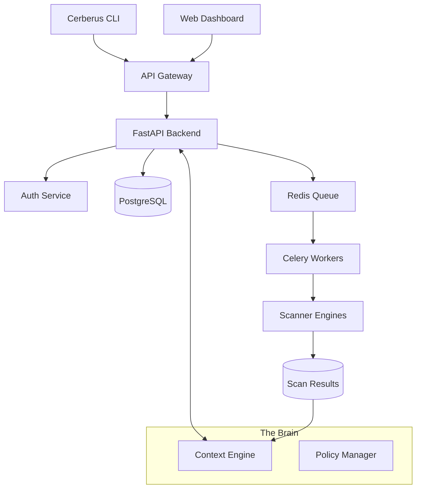

# Cerberus
> **The Context-Aware Vulnerability Orchestrator based on the SecureScan Framework.**

[](LICENSE)
[](https://python.org)
[](https://nodejs.org)
[](https://docker.com)
[](#security)

**Cerberus** is a production-grade vulnerability management platform designed to solve **Alert Fatigue**. Unlike traditional scanners that dump thousands of findings, Cerberus uses a **Context Engine** to correlate vulnerabilities with runtime context, environment criticality, and reachability.

> **The Problem**: 5,000 "Critical" bugs, but only 5 matter.
> **The Solution**: Cerberus tells you *which* 5 matter.

## Live Demo

- **Dashboard**: http://localhost:3000
- **API Docs**: http://localhost:8000/docs
- **CLI**: `securescan scan --help`


## Key Differentiators

### Context-Aware Prioritization
Cerberus doesn't just scan code; it understands it.
- **Environment Weighting**: A bug in `prod` > a bug in `dev`.
- **Reachability Analysis**: Is the vulnerable function actually called?
- **Public Exposure**: Is the service internet-facing?

### Unified Orchestration
Run the best-in-class tools under one roof.
- **SAST**: Semgrep
- **SCA**: Trivy
- **DAST**: OWASP ZAP
- **Secrets**: Gitleaks
- **IaC**: Checkov

### Developer Experience
- **VS Code Extension**: Real-time security linting
- **CLI Tool**: `cerberus scan --context=prod --reachability=true`
- **Modern Dashboard**: React-based vulnerability management
- **API-First**: RESTful APIs with OpenAPI docs

## Architecture Overview

> **Detailed Architecture**
>
> For comprehensive diagrams including System Overview, Scan Workflows, and Authentication Flows, please see [docs/ARCHITECTURE.md](docs/ARCHITECTURE.md).




## Quick Start

### Prerequisites
```bash
# Required
- Docker & Docker Compose
- Python 3.10+
- Node.js 18+
- Git

# Optional
- VS Code (for extension)
- Kubernetes (for production)
```

### 1. Clone & Setup
```bash
git clone https://github.com/yourusername/securescan-framework.git
cd securescan-framework

# Start infrastructure
docker-compose up -d

# Install dependencies
make install

# Run migrations
make migrate

# Start all services
make dev
```

### 2. Access Components
```bash
# Web Dashboard
open http://localhost:3000

# API Documentation
open http://localhost:8000/docs

# CLI Tool
securescan scan --path ./examples/vulnerable-app
```

### 3. Run Your First Scan
```bash
# Using CLI
securescan scan \
  --path ./examples/vulnerable-app \
  --scanners semgrep,trivy \
  --output sarif

# Using API
curl -X POST http://localhost:8000/api/v1/scan \
  -H "Authorization: Bearer $(cat .env | grep API_KEY | cut -d= -f2)" \
  -H "Content-Type: application/json" \
  -d '{
    "project_name": "my-app",
    "repo_url": "https://github.com/user/vulnerable-app",
    "scanners": ["semgrep", "trivy"]
  }'
```

## 📦 Project Structure

```
securescan-framework/
├── 📁 backend/                    # FastAPI Backend
│   ├── app/
│   │   ├── api/                   # REST API endpoints
│   │   ├── core/                  # Core services & config
│   │   ├── db/                    # Database models & migrations
│   │   ├── scanners/              # Scanner integrations
│   │   └── workers/               # Celery background tasks
│   ├── tests/                     # Backend tests
│   └── requirements.txt
├── 📁 frontend/                   # React Dashboard
│   ├── src/
│   │   ├── components/            # Reusable UI components
│   │   ├── pages/                 # Dashboard pages
│   │   ├── hooks/                 # Custom React hooks
│   │   └── services/              # API clients
│   ├── tests/                     # Frontend tests
│   └── package.json
├── 📁 cli/                        # Python CLI Tool
│   ├── securescan/
│   │   ├── commands/              # CLI commands
│   │   ├── core/                  # Core CLI logic
│   │   └── scanners/              # Scanner interfaces
│   ├── tests/                     # CLI tests
│   └── setup.py
├── 📁 vscode-extension/           # VS Code Extension
│   ├── src/                       # TypeScript source
│   ├── resources/                 # Extension assets
│   └── package.json
├── 📁 infrastructure/             # Deployment configs
│   ├── docker/                    # Docker configurations
│   ├── kubernetes/                # K8s manifests
│   └── terraform/                 # Infrastructure as Code
├── 📁 docs/                       # Documentation
│   ├── api/                       # API documentation
│   ├── guides/                    # User guides
│   └── architecture/              # Technical docs
├── 📁 examples/                   # Example projects
│   ├── vulnerable-app/            # Test application
│   └── ci-cd-configs/             # CI/CD examples
├── 📁 scripts/                    # Development scripts
├── docker-compose.yml             # Local development
├── Makefile                       # Development commands
└── README.md                      # This file
```

## 🔧 Development Setup

### Backend Development
```bash
cd backend
python -m venv venv
source venv/bin/activate
pip install -r requirements.txt
pip install -r requirements-dev.txt

# Run backend
uvicorn app.main:app --reload --host 0.0.0.0 --port 8000

# Run tests
pytest tests/ -v
```

### Frontend Development
```bash
cd frontend
npm install
npm run dev

# Run tests
npm test
npm run test:e2e
```

### CLI Development
```bash
cd cli
npm install
npm run build

# Link for local development
npm link

# Test CLI
securescan --help
securescan scan --path ../examples/vulnerable-app
```

### VS Code Extension Development
```bash
cd vscode-extension
npm install
npm run compile

# Test extension
code --extensionDevelopmentPath=$(pwd) ../examples/vulnerable-app
```

## 🧪 Testing

### Run All Tests
```bash
make test
```

### Individual Test Suites
```bash
# Backend tests
cd backend && pytest tests/ -v --cov=app

# Frontend tests
cd frontend && npm test -- --coverage

# CLI tests
cd cli && python -m pytest tests/

# Integration tests
python scripts/run_integration_tests.py

# E2E tests
npm run test:e2e
```

## 🚀 Deployment

### Development (Docker Compose)
```bash
docker-compose up -d
```

### Production (Kubernetes)
```bash
# Deploy to Kubernetes
kubectl apply -f infrastructure/kubernetes/

# Or use Helm
helm install securescan infrastructure/helm/
```

### Cloud Deployment
```bash
# AWS EKS
terraform apply infrastructure/terraform/aws/

# GCP GKE
terraform apply infrastructure/terraform/gcp/

# Azure AKS
terraform apply infrastructure/terraform/azure/
```

## 📊 Monitoring & Observability

### Metrics
- **Prometheus**: http://localhost:9090
- **Grafana**: http://localhost:3001
- **Dashboards**: Pre-configured security scanning metrics

### Logging
- **Structured logging** with JSON format
- **Centralized logs** with ELK stack
- **Audit trails** for all security operations

### Health Checks
```bash
# API Health
curl http://localhost:8000/health

# Scanner Health
curl http://localhost:8000/api/v1/scanners/health

# Database Health
curl http://localhost:8000/api/v1/health/db
```

## 🔒 Security

### Authentication
- **JWT tokens** for API access
- **API keys** for CLI/CI-CD integration
- **RBAC** for fine-grained permissions

### Secure Configuration
```bash
# Generate secure secrets
python scripts/generate_secrets.py

# Validate security config
securescan config validate

# Security audit
make security-audit
```

## 📈 Performance

### Benchmarks
- **Scan Speed**: 100K LOC in < 3 minutes
- **Concurrent Scans**: 10+ parallel scans
- **API Throughput**: 1000+ requests/second
- **Dashboard Load**: < 2 second initial load

### Optimization
- **Async processing** with Celery
- **Caching** with Redis
- **Database indexing** for fast queries
- **CDN integration** for static assets

## 🤝 Contributing

### Development Workflow
1. Fork the repository
2. Create a feature branch
3. Write tests for your changes
4. Implement the feature
5. Run the test suite
6. Submit a pull request

### Code Standards
- **Backend (Python)**: Black formatting, flake8 linting
- **Frontend/CLI (TypeScript)**: Prettier formatting, ESLint
- **Git**: Conventional commits
- **Documentation**: Keep docs updated

## 📚 Documentation

- 📖 [**User Guide**](./docs/guides/user-guide.md)
- 🔧 [**Developer Guide**](./docs/guides/developer-guide.md)
- 🏗️ [**Architecture Guide**](./docs/architecture/README.md)
- 🚀 [**Deployment Guide**](./docs/guides/deployment-guide.md)
- 📊 [**API Reference**](./docs/api/README.md)

## 🎯 Roadmap

### ✅ Phase 1: MVP (Current)
- [x] Core API with 3 scanners
- [x] CLI tool
- [x] Basic dashboard
- [x] Docker deployment

### 🚧 Phase 2: Enhancement (Q1 2026)
- [ ] VS Code extension
- [ ] 5+ additional scanners
- [ ] Advanced analytics
- [ ] Policy engine

### 🔮 Phase 3: Enterprise (Q2 2026)
- [ ] SSO integration
- [ ] Compliance reporting
- [ ] Multi-tenant support
- [ ] Enterprise connectors

## 📄 License

This project is licensed under the MIT License - see the [LICENSE](LICENSE) file for details.

## 🙏 Acknowledgments

- **Security Tools**: Semgrep, Trivy, OWASP ZAP, Gitleaks, Checkov
- **SARIF Standard**: Microsoft Security Static Analysis Results Format
- **Open Source Community**: All the amazing contributors

## 📞 Support

- 🐛 **Bug Reports**: [GitHub Issues](https://github.com/yourusername/securescan-framework/issues)
- 💬 **Discussions**: [GitHub Discussions](https://github.com/yourusername/securescan-framework/discussions)
- 📧 **Email**: security@yourdomain.com
- 💭 **Discord**: [Join our community](https://discord.gg/securescan)

---

**⭐ Star this repo if you find it useful!**

Made with ❤️ by the SecureScan community