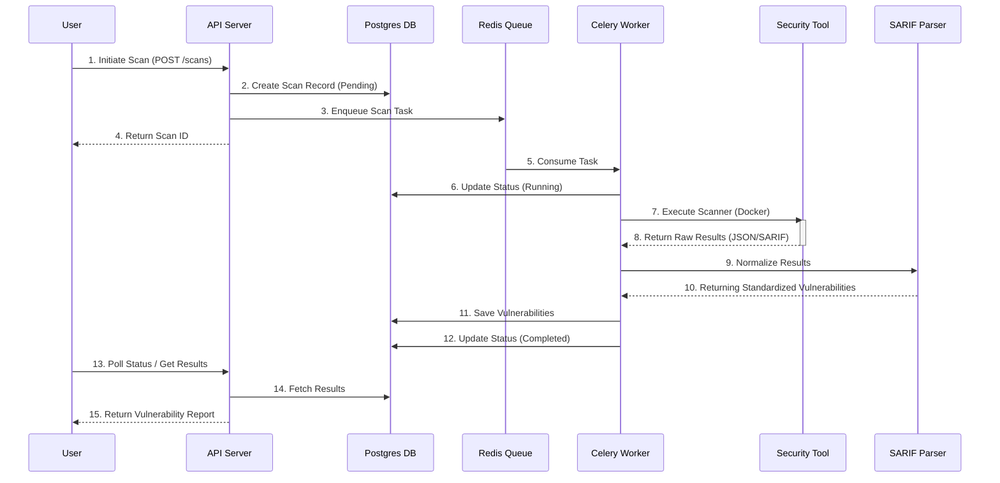

# Cerberus Architecture

This document provides a detailed overview of the **Cerberus** architecture, including system components, data flow, and key processes.

## System Overview

Cerberus is built on a microservices-inspired architecture, separating concerns between the API, background processing, and scanning engines.

```mermaid
graph TD
    subgraph Clients
        CLI[SafeScan CLI]
        Web[Web Dashboard]
        VS[VS Code Extension]
    end

    subgraph "API Gateway & Load Balancing"
        Nginx[Nginx Reverse Proxy]
    end

    subgraph "Application Layer"
        API[FastAPI Backend]
        Auth[Auth Service]
    end

    subgraph "Asynchronous Processing"
        Celery[Celery Workers]
        Redis[Redis (Broker/Cache)]
        Flower[Flower Dashboard]
    end

    subgraph "Data Persistence"
        PG[(PostgreSQL)]
        ES[(Elasticsearch)]
    end

    subgraph "Scanner Engine"
        Semgrep[Semgrep (SAST)]
        Trivy[Trivy (Container)]
        ZAP[OWASP ZAP (DAST)]
        Gitleaks[Gitleaks (Secrets)]
    end

    %% Connections
    CLI --> Nginx
    Web --> Nginx
    VS --> Nginx
    
    Nginx --> API
    
    API --> Auth
    API --> PG
    API --> Redis
    API --> ES
    
    Celery --> Redis
    Celery --> PG
    Celery --> ES
    
    Celery -.-> Semgrep
    Celery -.-> Trivy
    Celery -.-> ZAP
    Celery -.-> Gitleaks
```

## Scan Execution Flow

This diagram illustrates the lifecycle of a security scan, from initiation to result storage.



## Authentication & Authorization Flow

The framework uses JWT (JSON Web Tokens) for secure, stateless authentication.

```mermaid
flowchart LR
    subgraph Registration
        Reg[Register Request] --> Valid[Validate Input]
        Valid --> Hash[Argon2 Hash]
        Hash --> DB_Save[Save User (Pending)]
        DB_Save --> Email[Send Verification Email]
    end

    subgraph Login
        LoginReq[Login Request] --> Lookup[Find User]
        Lookup --> Verify[Verify Hash]
        Verify --> Check[Check Status (Active?)]
        Check --> JWT[Generate Access + Refresh Token]
        JWT --> Resp[Return Tokens]
    end

    subgraph Access
        Req[API Request] --> AuthHead[Bearer Token]
        AuthHead --> Decode[Decode JWT]
        Decode --> Exp{Expired?}
        Exp -- Yes --> Err[401 Unauthorized]
        Exp -- No --> Scope{Check Role}
        Scope -- Allowed --> Res[Resource Access]
        Scope -- Denied --> Err2[403 Forbidden]
    end
```

## Deployment Architecture

In production, services are containerized and orchestrated via Docker Compose or Kubernetes.

| Service | Technology | Role |
|---------|------------|------|
| **Backend** | Python/FastAPI | Core API logic, orchestration |
| **Frontend** | React/TypeScript | User interface |
| **Database** | PostgreSQL | Primary relational data store |
| **Cache/Queue** | Redis | Job queue and caching |
| **Search** | Elasticsearch | Fast vulnerability search & analytics |
| **Proxy** | Nginx | SSL termination, load balancing |
